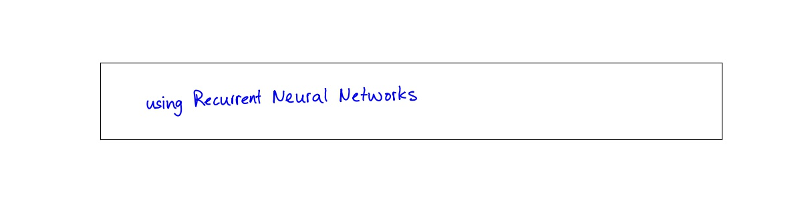
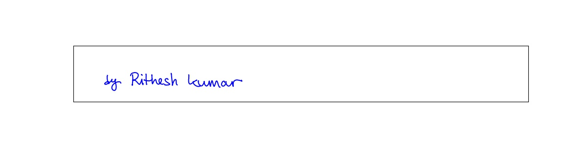

## Reproducing handwriting synthesis from the seminal paper - Generating Sequences Using Recurrent Neural Networks by Alex Graves

### Training
1. To train the unconditional synthesis with default arguments, execute:
```
python scripts/train_unconditional.py --save_path logs/unconditional
```
2. To train the conditional synthesis with default arguments, execute:
```
python scripts/train_conditional.py --save_path logs/conditional --seq_len 600
```

### Sampling
1. Use the ipython notebook `notebooks/write.ipynb`

### Unconditional Handwriting Samples


### Conditional Handwriting Samples



